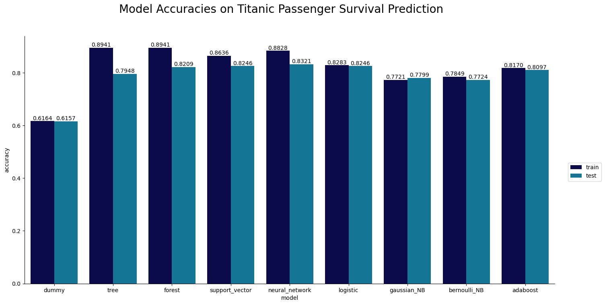
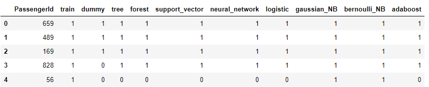
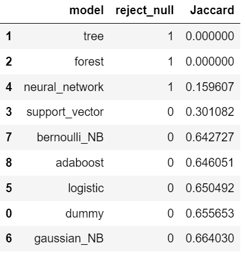
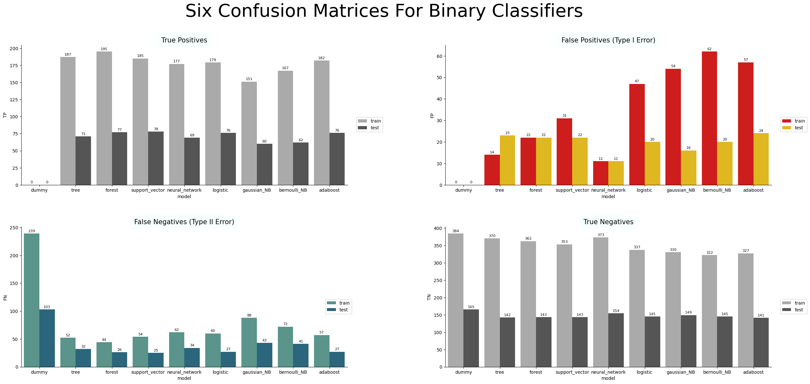
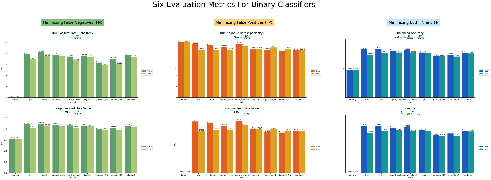
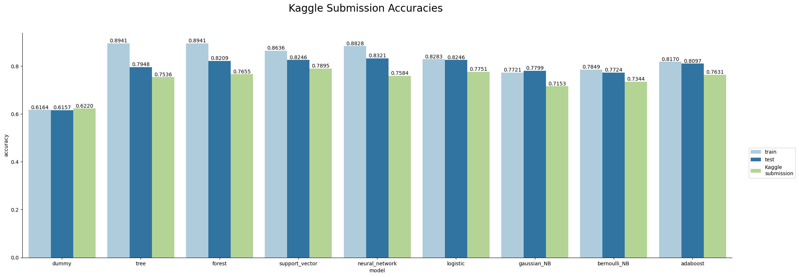

<h1 align="center">Predictive Modelling: Insights from a Kaggle Competition</h1>

<h4 style="text-align:center"><a href = 'https://github.com/virchan' style='text-align:center'>https://github.com/virchan</a></h4> 

<h2>Abstract</h2>

This project provides a comprehensive exploration of the predictive modeling workflow using the Kaggle competition "Titanic - Machine Learning from Disaster" as a case study. It delves into key stages such as exploratory data analysis and model evaluation, aiming to identify the most effective model for the competition. By treating the competition as a real-world predictive modeling task, this project enhances our understanding of the workflow while emphasizing the importance of rigorous model evaluation.

<h2>Introduction</h2>

Data permeates every aspect of our world, and harnessing its power through data-driven decision-making is crucial for progress. Predictive modeling is a powerful tool that enables organizations to streamline these decision-making processes, finding insights and making accurate predictions based on available data. Its applications span across diverse industries, such as healthcare, finance, and more. For instance, in the medical industry, predictive modeling can help hospitals predict human survival rates based on patients' medical and health conditions. In the financial industry, credit card companies leverage predictive models to determine whether a transaction is fraudulent. These real-life applications highlight the practical value of predictive modeling.

The workflow of predictive modeling involves several key stages. It begins with data acquisition, exploratory data analysis, and data cleaning to ensure the data is suitable for analysis. Subsequently, the data is tailored and fed into computers, which employ advanced algorithms to learn intricate patterns and relationships within the data. Once the learning process is complete, predictions are generated, enabling decision-makers to make informed choices based on the insights provided by the predictive models. This workflow forms the foundation of predictive modeling.

In this work, we simulate the predictive modeling workflow by participating in the Kaggle Getting Started competition __Titanic - Machine Learning from Disaster ([Kaggle link](https://www.kaggle.com/competitions/titanic/))__. By drawing an analogy between the competition's subtasks and the stages of real-life predictive modeling, we aim to provide an educational and insightful experience. The analogy is established as follows:

<table style="width:50%">
  <tr>
    <th style="text-align:center">Kaggle Competition Subtasks</th>
    <th style="text-align:center">Analogy to Real-life Predictive Modeling</th>
  </tr>
  <tr>
    <td style="text-align:center">Training the Model</td>
    <td style="text-align:center">Model Training Phase</td>
  </tr>
  <tr>
    <td style="text-align:center">Testing the Model</td>
    <td style="text-align:center">Offline Evaluation Phase</td>
  </tr>
  <tr>
    <td style="text-align:center">Submitting Predictions to Kaggle</td>
    <td style="text-align:center">Online Evaluation Phase</td>
  </tr>
</table>

Our workflow encompasses three main stages. The first stage is data preparation, which involves downloading the data, performing exploratory data analysis, and cleaning the dataset. The outcome of this stage is a cleaned dataset that will be used in the subsequent stage, model training. During the model training phase, we trained nine different machine learning models using various algorithms, including ensemble methods like random forest, deep learning methods like feedforward neural networks, and probabilistic models like Bayesian classifiers. These models were further scrutinized for overfitting, with decision tree classifiers, random forest classifiers, and neural networks exhibiting signs of overfitting. Through rigorous analysis, the support vector classifier emerged as the best model, demonstrating high accuracy and superior performance in minimizing both false positives and false negatives in classification tasks.

Next, we submitted our predictions to Kaggle to validate our findings on overfitting and model ranking. This process mirrors the online evaluation phase, allowing for an extensive comparison between the online and offline evaluation results. The Kaggle submission aligned with our conclusions on overfitting models and accurately predicted the best-performing model in the Kaggle competition based solely on testing performance.

This document primarily focuses on demonstrating the following workflows in predictive modeling:

1. Data Aquisition
2. Exploration Data Analysis
3. Data Cleaning
4. Data Preprocessing
5. Model Training
6. Model Evaluation

with a particular emphasis on model evaluation. It includes three Jupyter notebook files that delve into the technical details and discussions of the presented work:

<table style="width:70%">
  <tr>
    <th style="text-align:center">Jupyter Notebook File</th>
    <th style="text-align:center">Workflow</th>
    <th style="text-align:left">Description</th>
  </tr>
  <tr>
    <td style="text-align:center"><code>demo_titanic_data_cleaning.ipynb</code></td>
    <td style="text-align:center">Data Preparation</td>
    <td style="text-align:left">Includes data acquisition, exploratory data analysis, data cleaning, and data preprocessing.</td>
  </tr>
  <tr>
    <td style="text-align:center"><code>demo_ML_models.ipynb</code></td>
    <td style="text-align:center">Model Training</td>
    <td style="text-align:left">Trains machine learning models to predict Titanic passenger survival.</td>
  </tr>
  <tr>
    <td style="text-align:center"><code>demo_model_evaluation.ipynb</code></td>
    <td style="text-align:center">Model Evaluation</td>
    <td style="text-align:left">Focuses on overfitting detection and analysis of confusion matrices.</td>
  </tr>
</table>

Kaggle provides an excellent platform for accessing fascinating datasets and showcasing data-related talents. The work presented here aims to educate and document our workflow and results for reference within the data science and machine learning community.

<h2>Data Preparation</h2>

After downloading the data from Kaggle, we conducted exploratory data analysis to identify areas for data cleaning and preprocessing. Here are the key findings:

1. The `Embarked` column has missing values, which can be filled using reliable information from a third-party source.
2. The `Cabin` column requires cleaning by replacing the values with the corresponding cabin codes.
3. The `Age` column has missing values that can be filled with the mean age of the respective age groups.
4. To simplify the data, we replaced the `SibSp` and `Parch` columns with a new column called `group_size`, representing the total number of people traveling with each passenger.
5. We removed less relevant or redundant features by excluding the `Fare`, `Name`, and `Ticket` columns from further analysis.

To streamline the data preprocessing process, we developed our own `titanic_data_cleaning` library. Using this library, we performed the necessary data cleaning steps and obtained the cleaned data set stored as `csv/train_cleaned.csv` and `csv/test_cleaned.csv` files. The `csv/train_cleaned.csv` file was used for model training, where we trained nine distinct machine learning models to predict Titanic passenger survival. Subsequently, these trained models generated predictions on the `csv/test_cleaned.csv` file, and the predictions were submitted to the Kaggle competition for evaluation.

For a detailed walkthrough of our data preparation procedure, please refer to the `demo_titanic_data_cleaning.ipynb` file.

<h2>Model Training</h2>

The following machine learning models have been trained with the goal of predicting the survival of Titanic passengers.

<table style = "width:60%">
    
  <tr>
    <th style="text-align: center">Name</th>
    <th style="text-align: center">Notation</th>
    <th style="text-align: center">Type</th>
  </tr>
    
  <tr>
    <td style="text-align: right">Dummy Classifier</td>
    <td style="text-align: center"><code>dummy</code></td>
    <td style="text-align: center">Baseline Model</td>
  </tr>
    
  <tr>
    <td style="text-align: right">Decision Tree Classifier</td>
    <td style="text-align: center"><code>tree</code></td>
    <td style="text-align: center">Base Model</td>
  </tr>

  <tr>
    <td style="text-align: right">Random Forest Classifier</td>
    <td style="text-align: center"><code>forest</code></td>
    <td style="text-align: center">Ensemble Method</td>
  </tr>
    
  <tr>
    <td style="text-align: right">Support Vector Classifier</td>
    <td style="text-align: center"><code>support_vector</code></td>
    <td style="text-align: center">Support Vector Machine</td>
  </tr>
    
  <tr>
    <td style="text-align: right">Neural Network</td>
    <td style="text-align: center"><code>neural_network</code></td>
    <td style="text-align: center">Deep Learning Method</td>
  </tr>
    
  <tr>
    <td style="text-align: right">Logistic Regression</td>
    <td style="text-align: center"><code>logistic</code></td>
    <td style="text-align: center">Linear Model</td>
  </tr>
    
  <tr>
    <td style="text-align: right">Gaussian Naive Bayes Classifier</td>
    <td style="text-align: center"><code>gaussian_NB</code></td>
    <td style="text-align: center">Probabilistic Model</td>
  </tr>
    
  <tr>
    <td style="text-align: right">Bernoulli Naive Bayes Classifier</td>
    <td style="text-align: center"><code>bernoulli_NB</code></td>
    <td style="text-align: center">Probabilistic Model</td>
  </tr>
    
  <tr>
    <td style="text-align: right">AdaBoost Classifier</td>
    <td style="text-align: center"><code>adaboost</code></td>
    <td style="text-align: center">Ensemble Method</td>
  </tr>
</table>

To establish a baseline for model comparison, we include the Dummy Classifier. This allows us to assess the reliability of other classifiers, as any model that falls short of outperforming the Dummy Classifier lacks credibility. While Logistic Regression serves as the simplest non-trivial model for classification tasks, we recognize its limitations in capturing complex data structures associated with human survivability. To address this, we introduce the Neural Network and Support Vector Machine models, which offer enhanced reliability. Furthermore, we acknowledge that the features in our training set are categorical. To facilitate practical model training, we convert these categorical features into binary features, treating them as a series of yes-or-no questions. This conversion aligns naturally with the Decision Tree Classifier, Bernoulli Naive Bayes Classifier, and arguably, the Random Forest Classifier. Additionally, we include the Gaussian Naive Bayes Classifier and Adaboost Classifier to diversify our range of models.

For detailed information on each model and its specific parameters, please refer to the `demo_ML_models.ipynb` file.

<h2>Model Evaluation</h2>

Within the realm of predicting the survival of Titanic passengers, a thorough evaluation has been undertaken, involving the training of nine distinct machine learning models. The primary focus of this evaluation phase is to identify the most suitable model for the upcoming Kaggle competition, utilizing the provided training data. 

The foundation of our evaluation phase lies in the accuracy scores derived from each prediction submitted to Kaggle ([Kaggle leaderboard link](https://www.kaggle.com/competitions/titanic/leaderboard)). In the preceding section, we trained nine different models using the `csv\train_cleaned.csv` dataset and obtained the corresponding training and testing predictions from the `csv\data\predictions.csv` dataset. Our aim is to identify the model with the highest Kaggle submission accuracy, based solely on its training and testing performances using the `predictions.csv` dataset. By solely relying on these performances, we can make a reliable assessment of the model's predictive capabilities and its potential for success in the Kaggle competition. The evaluation procedure unfolds as follows:

1. Firstly, We examine the training and testing accuracies of each model to detect signs of overfitting.
2. Next, we select the models that pass the overfitting test and exhibit the highest testing accuracies.
3. In the event of a tie, we employ post-hoc analyses, such as analysis on confusion matrices, to identify the better model.
4. Finally, we compare our findings with the Kaggle submission accuracies, validating if our recommended choice indeed emerges as the Kaggle champion among all evaluated models, or if it simply represents another instance of overfitting.

We initiate this section with a brief examination of the training and testing accuracies, thereby providing valuable insights into the performance of each model. Subsequently, we perform hypothesis testing to detect any potential cases of overfitting across the models. To make an informed decision for the Kaggle competition, the application of confusion matrices enables a comprehensive assessment of the models, ultimately leading to the identification of the optimal model.

Supplementing this section are the `demo_model_evaluation.ipynb` and the `titanic_ml_classes\titanic_evaluation_helpers.py` files. The former serves as a comprehensive guide, providing essential coding details for the evaluation phase. Notably, it includes the source codes for each captivating visualization exemplified in this section. The latter is a collection of custom `Python` functions, tailored to facilitate our in-depth analysis. Together, these invaluable assets provide both the practical implementation and technical tools necessary for a comprehensive understanding of our evaluation methodology.

<h3>A First Inpsection of the Training and Testing Accuracies</h3>

The training and testing accuracy for each model are given in the bar chart.

The `neural_network` model achieves the highest testing accuracy of 0.8320, showing a marginal improvement of only 0.91% over the `support_vector` and `logistic` models, which obtained a score of 0.8246. Following closely in the third position is the `forest` model with an accuracy of 0.8209, followed by `adaboost` (0.8097), `gaussian_NB` (0.7799), and `bernoulli_NB` (0.7724). It is noteworthy that the `dummy` model exhibits the lowest performance, scoring only 0.6157.

Can we infer from these results that the `neural_network` model will surpass the others in the final submission stage?  It is worth noting that there is a substantial disparity between the training and testing accuracies for the `neural_network`, as well as the `tree` and `forest` models. Therefore, it is crucial to determine if a candidate is overfit before considering it as the champion. In fact, evaluating for overfitting should be the first step in the model assessment process.

<h3>Hypothesis Testing and Cofidence Intervals in Overfitting Detection</h3>

The general principle states that a reliable machine learning model should exhibit consistent performance in both the training and testing phases. Therefore, our primary goal is to identify any notable disparities between the training and testing performances, which would indicate an overfitted model.

In an analytical context, the comparison involves analyzing data obtained from the training and testing phases. This is where hypothesis testing comes into play. We formulate the null hypothesis as "the training accuracy is equal to the testing accuracy" and the alternative hypothesis as "the training accuracy is not equal to the testing accuracy" for each model:

To facilitate this analysis, we create a new dataframe called `correct_predictions`, where the column `correct_predictions[model]` is a binary array that indicates whether a sample is correctly classified. Please refer to the screenshot below for a glimpse of `correct_predictions.head()`. 

This construction is crucial, because the column `correct_predictions[model]` represents a series of `n = number of rows` independent Bernoulli trials, each having probability `p = model's accuracy` of success. Under this description, the de Moivre-Laplace Theorem ([Wikipedia link](https://en.wikipedia.org/wiki/De_Moivre%E2%80%93Laplace_theorem)) tells us that the normal distribution naturally emerges within our dataset, allowing us to utilize either the Z-test (if `n > 30`) or the Student's t-test (if `n <= 30`). 

By applying the Two Proportion Z-Test to the columns `correction_predictions[model]` for `train = 0` and `train = 1`, we can compare the accuracies and effectively quantify the detection of overfitting. We have set the significant level `alpha = 0.05`. Additionaly, to futher analyze the results, we also compute the 95% confidence intervals for the training and testing accuracies. The result is displayed in the following table, a corresponding image file is available [here](images/[code_output][022][two_prop_Z_test_results].png).

<table style = "width:90%">
    
  <tr>
    <th style="text-align: center">Model</th>
    <th style="text-align: center">Training Accuracy</th>
    <th style="text-align: center">Testing Accuracy</th>
    <th style="text-align: center">95% Confidence Interval for Training Accuracy</th>
    <th style="text-align: center">95% Confidence Interval for Testing Accuracy</th>
    <th style="text-align: center">z-score</th>
    <th style="text-align: center">p-value</th>
    <th style="text-align: center">Reject Null Hypothesis?</th>
  </tr>
    
  <tr>
    <td style="text-align: center"><code>dummy</code></td>
    <td style="text-align: center">0.6164</td>
    <td style="text-align: center">0.6157</td>
    <td style="text-align: center">(0.5782, 0.6546)</td>
    <td style="text-align: center">(0.5574, 0.6739)</td>
    <td style="text-align: center">0.0197</td>
    <td style="text-align: center">0.9843</td>
    <td style="text-align: center">False</td>
  </tr>
    
  <tr>
      <td style="text-align: center"><code>tree</code></td>
      <td style="text-align: center">0.8941</td>
      <td style="text-align: center">0.7948</td>
      <td style="text-align: center">(0.8699, 0.9182)</td>
      <td style="text-align: center">(0.7464, 0.8431)</td>
      <td style="text-align: center">3.9673</td>
      <td style="text-align: center">0.0001</td>
      <td style="text-align: center">True</td>
  </tr>

  <tr> 
      <td style="text-align: center"><code>forest</code></td>
      <td style="text-align: center">0.8941</td>
      <td style="text-align: center">0.8209</td>
      <td style="text-align: left">(0.8699, 0.9182)</td>
      <td style="text-align: center">(0.7750, 0.8668)</td>
      <td style="text-align: center">2.9984</td>
      <td style="text-align: center">0.0027</td>
      <td style="text-align: center">True</td>
  </tr>
    
  <tr>
      <td style="text-align: center"><code>support_vector</code></td>
      <td style="text-align: center">0.8636</td>
      <td style="text-align: center">0.8246</td>
      <td style="text-align: center">(0.8366, 0.8905)</td>
      <td style="text-align: center">(0.7791, 0.8702)</td>
      <td style="text-align: center">1.5004</td>
      <td style="text-align: center">0.1335</td>
      <td style="text-align: center">False</td>
  </tr>
    
  <tr>
      <td style="text-align: center"><code>neural_network</code></td>
      <td style="text-align: center">0.8828</td>
      <td style="text-align: center">0.8321</td>
      <td style="text-align: center">(0.8576, 0.9081)</td>
      <td style="text-align: center">(0.7873, 0.8768)</td>
      <td style="text-align: center">2.0490</td>
      <td style="text-align: center">0.0405</td>
      <td style="text-align: center">True</td>
  </tr>
    
  <tr>
      <td style="text-align: center"><code>logistic</code></td>
      <td style="text-align: center">0.8283</td>
      <td style="text-align: center">0.8246</td>
      <td style="text-align: center">(0.7986, 0.8579)</td>
      <td style="text-align: center">(0.7791, 0.8702)</td>
      <td style="text-align: center">0.1312</td>
      <td style="text-align: center">0.8956</td>
      <td style="text-align: center">False</td>
  </tr>
    
  <tr>
      <td style="text-align: center"><code>gaussian_NB</code></td>
      <td style="text-align: center">0.7721</td>
      <td style="text-align: center">0.7799</td>
      <td style="text-align: center">(0.7391, 0.8050)</td>
      <td style="text-align: center">(0.7302, 0.8295)</td>
      <td style="text-align: center">-0.2548</td>
      <td style="text-align: center">0.7989</td>
      <td style="text-align: center">False</td>
  </tr>
    
  <tr>
      <td style="text-align: center"><code>bernoulli_NB</code></td>
      <td style="text-align: center">0.7849</td>
      <td style="text-align: center">0.7724</td>
      <td style="text-align: center">(0.7526, 0.8172)</td>
      <td style="text-align: center">(0.7222, 0.8226)</td>
      <td style="text-align: center">0.4146</td>
      <td style="text-align: center">0.6784</td>
      <td style="text-align: center">False</td>
  </tr>
    
  <tr>
      <td style="text-align: center"><code>adaboost</code></td>
      <td style="text-align: center">0.8170</td>
      <td style="text-align: center">0.8097</td>
      <td style="text-align: center">(0.7867, 0.8474)</td>
      <td style="text-align: center">(0.7627, 0.8567)</td>
      <td style="text-align: center">0.2577</td>
      <td style="text-align: center">0.7966</td>
      <td style="text-align: center">False</td>
  </tr>
</table>

The hypothesis test reveals statistically significant differences between the training and testing accuracies for the `tree`, `forest`, and `neural_network` models. Moreover, the Jaccard index ([Wikipedia link](https://en.wikipedia.org/wiki/Jaccard_index)) 

demonstrates a substantial dissimilarity between the training and testing confidence intervals. These findings strongly indicate the presence of overfitting. As a result, we have excluded the `tree`, `forest`, and `neural_network` models from the selection pool, even the `neural_network` model exhibits the highest testing accuracy.

Our next canddidates are `support_vector` and `logistic`, sharing an accuracy of 0.8246. How should one break the tie in a situation like this?

<h3>Analysis of Model Performance using Confusion Matrix</h3>

The accuracy of a model is defined as the ratio of correctly classified instances to the total number of instances, as shown by the formula:

<!-- $$\mbox{Accuracy} = \frac{TP + TN}{TP + FP + FN + TN},$$ -->

where TP, TN, FP, and FN represent the numbers of True Positives, True Negatives, False Positives, and False Negatives, respectively. It is important to note that maximizing accuracy involves minimizing both False Positives and False Negatives. Therefore, it becomes crucial to thoroughly understand a model's capability in minimizing these errors.

To facilitate this understanding, we have included visual representations of six confusion matrices in the form of four bar graphs, which can be seen below:

Analyzing these visualizations, we observe that the `support_vector` model appears to demonstrate a greater control over FN and FP. We utilize the following evaluation metrics to quantify the model's performance on suppressing incorrectly classified instances:

<table style = "width:40%">
    
  <tr>
    <th style="text-align: center">Metric</th>
    <th style="text-align: center">Formula</th>
  </tr>
    
  <tr>
    <td style="text-align: center">True Positive Rate (Sensitivity)</td>
    <td style="text-align: center"> </td>
  </tr>
    
  <tr>
    <td style="text-align: center">Negative Predictive Value</td>
    <td style="text-align: center"></td>
  </tr>
    
  <tr>
    <td style="text-align: center">True Negative Rate (Specifity)</td>
    <td style="text-align: center"></td>
  </tr>
    
  <tr>
    <td style="text-align: center">Positive Predictive Value</td>
    <td style="text-align: center"></td>
  </tr>
    
  <tr>
    <td style="text-align: center">Balanced Accuracy</td>
    <td style="text-align: center"></td>
  </tr>
    
  <tr>
    <td style="text-align: center">F-score</td>
    <td style="text-align: center"></td>
  </tr>
    
</table>

Take the True Negative Rate (TNR), for instance. Having a TNR closer to 1 is equivalent to having a lower value for FP. Therefore, a higher TNR score indicates a stronger ability to minimize FP. 

For a more detailed and technical discussion on the evaluation metrics, including the rationale behind their selection, we recommend referring to the `demo_model_evaluation.ipynb` file. Within the notebook, you will find in-depth explanations and insights into the metrics, providing a deeper understanding of their significance in our analysis.

We have also provided visual representations of these metrics in the form of bar graphs:

In terms of FN-minimizing metrics, such as the True Positive Rate and the Negative Predictive Value, the `support_vector` model outperforms the `logistic` model. Specifically, the True Positive Rate in testing is 0.7573 for the `support_vector` model compared to 0.7379 for the `logistic` model, while the Negative Predictive Value is 0.8512 for the `support_vector` model and 0.8430 for the `logistic` model. Consequently, the `support_vector` model demonstrates a 0.96% improvement in minimizing False Negatives compared to the `logistic model`.

Conversely, when examining FP-minimizing metrics, such as the Positive Predictive Value and the True Negative Rate, demonstrate the opposite trend. The `logistic` model exhibits a more favorable trend with values of 0.7917 and 0.8788 respectively, compared to 0.7800 and 0.8667 for the `support_vector` model.This explains the identical accuracy observed between the `support_vector` and `logistic` models: the former excels in controlling False Negatives, while the latter showcases superior performance in suppressing False Positives. Overall, the `logistic` model outperforms the `support_vector` model by at least 1.38% in terms of minimizing False Positives.

To make a definitive decision between the two models, it becomes imperative to employ metrics that effectively minimize both False Positives and False Negatives simultaneously. Notably, the `support_vector` model outperforms the logistic model in metrics like the Balanced Accuracy (0.8120 for `support_vector` versus 0.8083 for `logistic`) and the F-score (0.7685 for `support_vector` versus 0.7638 for `logistic`) based on testing results. Consequently, the `support_vector` model surpasses the `logistic` model by at least 0.46% in effectively minimizing both False Positives and False Negatives.

In summary, the `support_vector` model demonstrates superior control over the occurrence of False Positives and False Negatives compared to the `logistic` model, making it the recommended choice for the Kaggle competition. Our comprehensive analysis provides valuable insights into the model's performance, allowing us to make an informed comparison with Kaggle submissions.

<h3>Evaluating Model Performance: Kaggle Submission Results</h3>

Based on the previous analysis, two key conclusions can be drawn:

1. at the 95% confidence level, the `tree`, `forest`, and `neural_network` models exhibit signs of overfitting.
2. Despite sharing the same testing accuracy, the `support_vector` model is expected to outperform the `logistic` model in the Kaggle competition.

To validate these conclusions, predictions from each model were submitted to the Kaggle competition. The bar chart below illustrates the Kaggle submission results, and a screenshot of the Kaggle submission result can be viewed [here](images/[submission_result][20230517].png).

Among the models evaluated, the `support_vector` model emerged as the top-performing model with an impressive accuracy score of 0.7895 in the Kaggle submission. Following closely behind is the `logistic` model, which attained a commendable accuracy score of 0.7751, securing the second position. The `forest` model occupied the third position with a respectable accuracy score of 0.7656, followed by `adaboost` (0.7632), `neural_network` (0.7584), `tree` (0.7536), `bernoulli_NB` (0.7344), and `gaussian_NB` (0.7153). 

It is important to note that the accuracy values displayed in the bar chart may differ slightly due to a known bug related to rounding in the `matplotlib` library. However, this discrepancy does not affect the rankings and relative performance of the models.

Among the evaluated models, the `dummy` model exhibited the lowest performance, achieving an accuracy score of only 0.6220.

Furthermore, analyzing the Kaggle submission results reinforces our observations regarding the overfitting behavior of the models. All Kaggle submission accuracies, except for the `dummy` model, are lower than the testing accuracies. This indicates that the `tree`, `forest`, and `neural_network` models indeed suffer from overfitting, as their performance declines when applied to unseen data. Notably, the submission accuracies of the `forest` and `neural_network` models lie outside the 95% confidence interval of their testing accuracies, highlighting a more severe overfitting condition.

In contrast, the submission accuracy for the `support_vector` model falls within the confidence interval of the testing accuracy. This consistency between the testing phase and the final submission phase reaffirms the reliability of the `support_vector` model, which demonstrates the best performance among all evaluated models in the Kaggle competition.

<h2>Conclusion</h2>

The Kaggle submission results reinforce our conclusions regarding the overfitting behavior of the `tree`, `forest`, and `neural_network` models. Additionally, the `support_vector model`, with the highest submission accuracy among all evaluated models, proves to be a reliable choice for the Kaggle competition.

Overall, these findings emphasize the importance of addressing overfitting issues and selecting appropriate models to achieve optimal performance in machine learning competitions.
